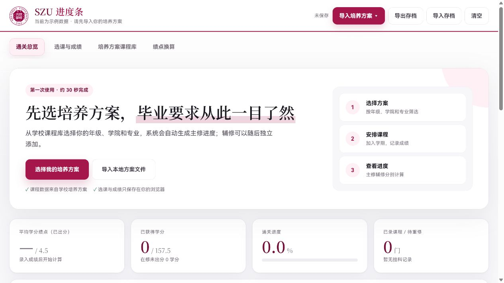

<div align="center">

# SZU Progress Tracker

**把培养方案、课程安排和毕业进度放进一个清爽的个人工作台。**

[在线体验](http://yumao.japaneast.cloudapp.azure.com/) · [本地运行](#在本地运行) · [数据说明](#培养方案数据库)

</div>

<br>

<a href="http://yumao.japaneast.cloudapp.azure.com/">
  
</a>

<div align="center">
  <sub>点击图片即可打开在线体验版</sub>
</div>

<br>

> 首次使用时导入主修培养方案；之后用它安排课程、记录成绩，并随时查看离毕业还有多远。

## 为学生而做

| 培养方案导入 | 课程与成绩 | 毕业进度 |
| --- | --- | --- |
| 从本地文件或云端方案库导入 | 按学期安排课程并记录成绩 | 自动汇总学分、绩点和模块完成度 |
| 支持年级、学院、修读类型筛选 | 支持等级制、百分制、附加题和不计绩点 | 主修、辅修分别计算，彼此不混淆 |

### 你可以用它做什么

- **快速导入方案**：支持 DOC、DOCX、RTF、PDF 文件，也可以直接从云端方案库按年级、学院和关键词挑选。
- **管好一学期的课**：从课程库选课或自定义课程，拖动调整顺序，按不同录入方式填写成绩。
- **看懂自己的进度**：自动计算已获得学分、在修学分、平均学分绩点和各类毕业要求完成情况。
- **放心添加辅修**：主修决定毕业总学分与模块要求；辅修独立展示进度，误导入时可单独移除。

## 培养方案数据库

| 覆盖年级 | 培养方案 | 课程记录 |
| --- | ---: | ---: |
| 2025 级 | 328 | — |
| 2024 级 | 354 | — |
| 2023 级 | 357 | — |
| **合计** | **1,039** | **110,187** |

数据整理自深圳大学官网已发布培养方案的详情数据。相同名称的方案可能归属不同学院，因此系统按照官网方案标识区分，而非仅按名称去重。

## 在本地运行

准备好 Node.js 后，克隆本仓库并在项目目录执行：

```powershell
npm run serve
```

浏览器打开 <http://127.0.0.1:4173>，即可开始使用。

<details>
<summary><strong>项目文件一览</strong></summary>

<br>

```text
site/
  index.html        # 单页应用
  plan-db/          # 可直接导入的培养方案数据
scripts/
  serve.mjs         # 本地静态服务
  test-*.mjs        # 页面与主辅修进度检查
```

</details>

## 隐私与数据边界

- 仓库只包含网页运行所需的公开培养方案数据。
- 原始抓取数据、服务器快照、部署文件、历史备份与私钥均不会提交。
- 课程和成绩仅保存在你自己的浏览器本地存储中；本项目不会上传或收集个人学习记录。

---

<div align="center">
  <sub>学生自主开发的效率工具，不代表深圳大学官方系统。培养方案和毕业要求请以学校最新正式通知为准。</sub>
</div>
